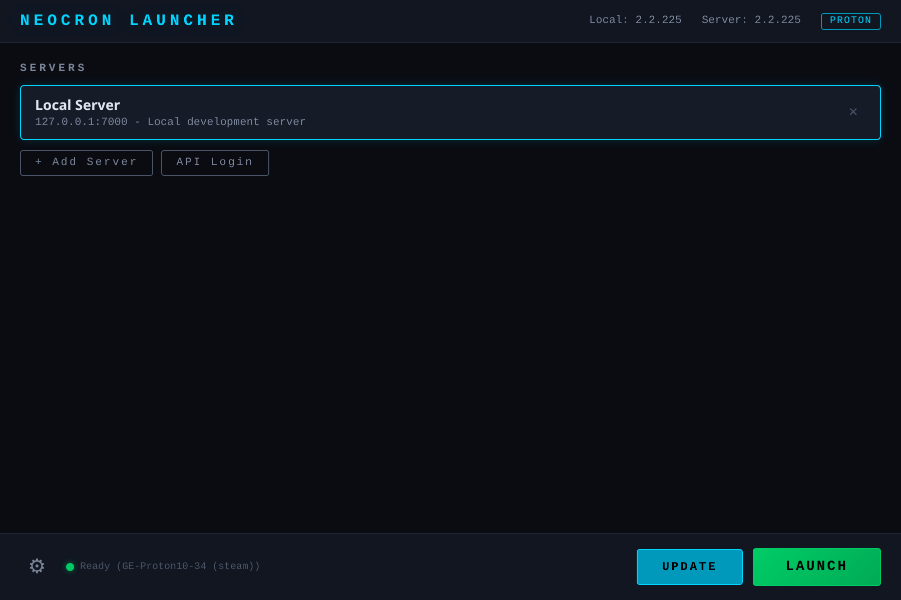
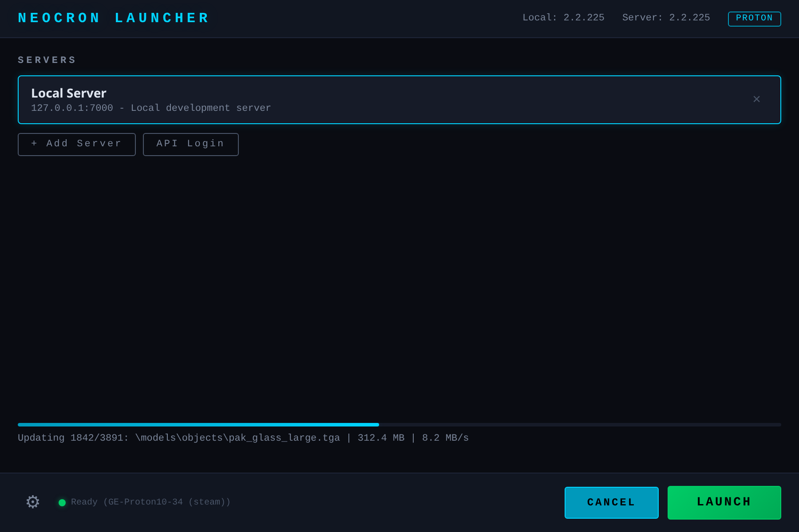
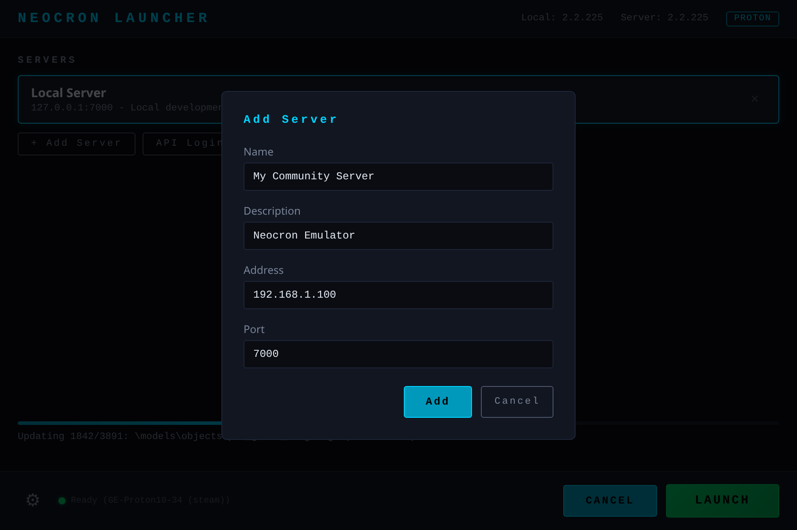
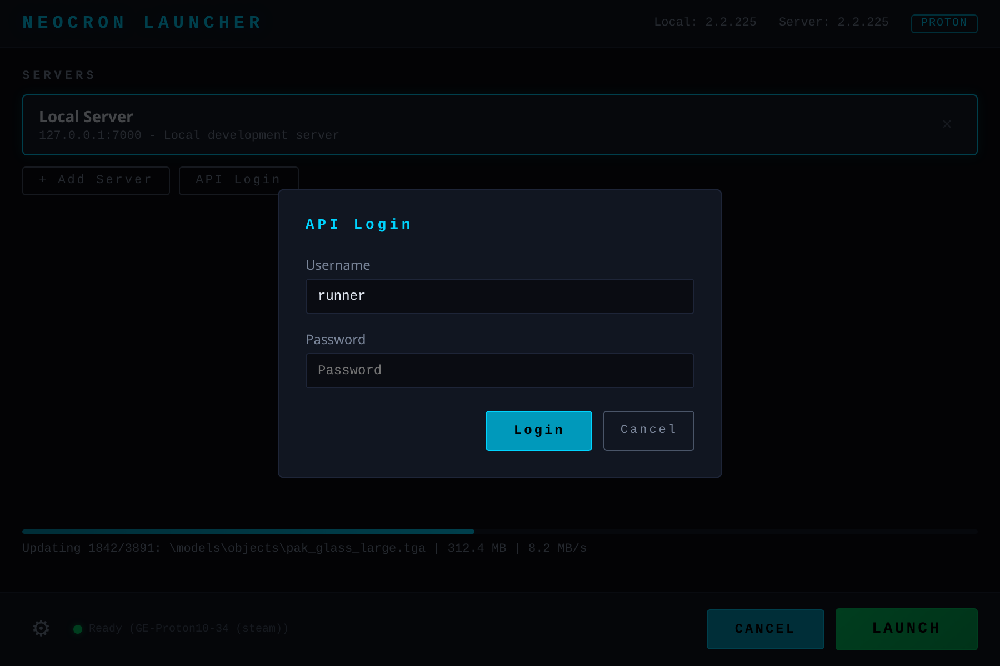

# Neocron Launcher

Cross-platform game launcher and installer for [Neocron 2](https://en.wikipedia.org/wiki/Neocron), built with Go and [Wails](https://wails.io). Designed for use with community server emulators since the official servers are no longer maintained.

## Why
I fell in love with Neocron during the open beta in the early 2000s and have followed the project ever since. As the game transitioned to community-run servers, I found myself in a cycle of "returning to the city" every few months, only to be met with the same technical hurdles:
 - **The Wine Struggle**: Getting the original .NET launcher to play nice with Wine/Proton required constant manual overrides and prefix tweaking.
 - **The "Context Switch" Tax**: Every time life or work forced me to take a break, returning to the game meant hours of re-learning how to fix my broken installation.
 - **Fragmentatio**n: Managing patches, high-resolution texture packs, and server-specific configurations was a tedious, manual process.
I built this launcher to solve these problems once and for all. It provides a single-binary, zero-config solution that handles the heavy lifting—from Proton prefix management to delta updates and custom patching—so we can spend less time in the terminal and more time in Neocron.

## Features

- **Game installer & updater** — Downloads the full game from the Neocron CDN, verifies files via MD5 hashes, and performs delta updates (only changed files). Supports concurrent downloads, automatic retry, and resume after interruption.
- **Server manager** — Add, remove, and select game server endpoints. Supports importing servers from the Neocron SOAP API.
- **Proton runtime** — Auto-detects Steam Proton installations, downloads [GE-Proton](https://github.com/GloriousEggroll/proton-ge-custom) from GitHub, and manages Wine prefixes. Linux and macOS launch the game through Proton; Windows launches natively.
- **SOAP API client** — Connects to Neocron's management APIs (SessionManagement, LauncherInterface, PublicInterface) for authentication, application discovery, and server endpoint retrieval.
- **PAK archive support** — Reads and writes the Neocron PAK archive format (single-file and multi-file variants).
- **Runtime toggles** — DXVK, GameMode (Linux), MangoHud overlay.
- **Addons** — GitHub-hosted file packs (texture upgrades, audio mods, graphics wrappers) installed by repo URL. Wrapper addons can declare DLL overrides that the launcher composes into `WINEDLLOVERRIDES` automatically.
- **Game log viewer** — Streams stdout/stderr from the running game process.

## Screenshots

### Main Screen


### Installing / Updating


### Settings
| General | Runtime |
|---------|---------|
|  |  |

### Server Management
| Add Server | API Login |
|-----------|-----------|
|  |  |

> Screenshots are auto-generated with Playwright. Run `cd frontend && npm run screenshots` with `wails dev` running.

## Documentation

- [Wiki](https://github.com/igwtech/Neocron-Launcher/wiki) — Full user manual
- [Installation Guide](docs/manual/installation.md)
- [Configuration](docs/manual/configuration.md)
- [Wine/Proton Setup](docs/manual/wine-setup.md)
- [Server Setup](docs/manual/server-setup.md)
- [Troubleshooting](docs/manual/troubleshooting.md)

## Building

### Prerequisites

- [Go](https://go.dev/) 1.23+
- [Node.js](https://nodejs.org/) 20+
- [Wails CLI](https://wails.io/docs/gettingstarted/installation) v2

**Linux** (additional):
```bash
sudo pacman -S gtk3 webkit2gtk   # Arch/Manjaro
sudo apt install libgtk-3-dev libwebkit2gtk-4.0-dev   # Debian/Ubuntu
```

**macOS** (additional):
```bash
xcode-select --install
```

### Install Wails

```bash
go install github.com/wailsapp/wails/v2/cmd/wails@latest
```

### Build

```bash
wails build
```

The binary is output to `build/bin/launcher`.

### Development

```bash
wails dev
```

This starts a live-reloading development server with hot reload for frontend changes.

## Project Structure

```
├── app.go                    # Wails app bindings (config, update, launch, API)
├── main.go                   # Entry point
├── wails.json                # Wails project config
├── pkg/
│   ├── config/config.go      # JSON config (~/.config/neocron-launcher/)
│   ├── updater/updater.go    # CDN updater (hashdata, delta downloads, resume)
│   ├── pak/pak.go            # PAK archive format reader/writer
│   ├── neocronapi/client.go  # SOAP API client (session, launcher, public)
│   ├── proton/
│   │   ├── manager.go        # Proton build detection & GE-Proton downloader
│   │   └── prefix.go         # Wine/Proton prefix management + WINEDLLOVERRIDES composer
│   ├── addon/
│   │   ├── manager.go        # GitHub-tarball addon installer + WINEDLLOVERRIDES contributor
│   │   └── state.go          # addon.json manifest schema + persisted state
│   └── launcher/launcher.go  # Platform-aware game process launcher
├── frontend/
│   ├── index.html            # UI shell
│   └── src/
│       ├── main.js           # Frontend logic
│       └── style.css         # Dark cyberpunk theme
└── .github/
    └── workflows/
        └── release.yml       # CI/CD: builds for 6 platforms on tag push
```

## Configuration

Config is stored at `~/.config/neocron-launcher/config.json` and includes:

| Setting | Default | Description |
|---------|---------|-------------|
| `installDir` | `~/Neocron2` | Game installation directory |
| `cdnBaseUrl` | `http://cdn.neocron-game.com/...` | CDN for game files |
| `apiBaseUrl` | `http://api.neocron-game.com:8100` | Neocron management API |
| `runtimeMode` | `proton` (Linux/macOS), `native` (Windows) | How to run the game |
| `enableDxvk` | `true` | Use DXVK for DirectX translation |
| `enableGameMode` | `true` (Linux) | Use Feral GameMode |
| `enableMangoHud` | `false` | Show MangoHud overlay |

## Addons

Addons are GitHub repos containing an `addon.json` manifest plus the files to drop into the game install directory. Install one by pasting its repo URL into the Addons tab.

`addon.json` schema:

```json
{
  "id": "neocron-graphics-pack",
  "name": "Enhanced Graphics (dgVoodoo2 + ReShade)",
  "version": "0.1.0",
  "category": "graphics",
  "files": [
    { "src": "D3D8.dll",  "dst": "D3D8.dll" },
    { "src": "dxgi.dll",  "dst": "dxgi.dll" }
  ],
  "wineDllOverrides": ["d3d8", "dxgi"],
  "requires":  ["some-other-addon-id"],
  "conflicts": ["incompatible-addon-id"]
}
```

**Priority and load order.** When two addons declare the same destination path, the higher-priority addon wins. Newly installed addons go to the top of the stack; reorder with the up/down arrows in the Addons tab. The launcher uses a shared pristine-snapshot pool, so disabling the top of a stack restores the *next layer down* rather than the original game file — the same way Skyrim mod managers handle layered overrides.

**Dependencies and conflicts.** `requires` is enforced at install + enable time (transitively, with cycle detection — auto-enables missing deps). `conflicts` refuses enable when a conflicting addon is already enabled. Disabling or uninstalling an addon that other enabled addons require is refused.

**Wine DLL overrides.** When enabled, `wineDllOverrides` entries are composed into a single `WINEDLLOVERRIDES=quartz=n,b;d3d8=n,b;dxgi=n,b...` env var at game launch — pulled from the union across enabled addons.

**CDN-update safety.** Update flow is two-phase: pre-update unstamps all addon files (install dir = pristine), CDN updater runs, post-update refreshes the pristine pool from the now-updated install dir, then re-stamps the enabled stack in priority order. Wrapper DLLs survive game patches.

The first-party Enhanced Graphics pack (dgVoodoo2 DX8→D3D11 wrapper + ReShade post-processing) lives at <https://github.com/igwtech/neocron-graphics-pack>. Paste that URL into the Addons tab to install — once the upstream binaries are bundled, this is the recommended graphics setup for Linux/Proton.

## Releases

Pre-built binaries are available on the [Releases](https://github.com/igwtech/Neocron-Launcher/releases) page for:

| Platform | Architecture |
|----------|-------------|
| Linux | amd64, arm64 |
| Windows | amd64, arm64 |
| macOS | amd64 (Intel), arm64 (Apple Silicon) |

To trigger a release, push a version tag:

```bash
git tag v0.1.0
git push --tags
```

## How It Works

1. **Version check** — Fetches `_version._` from the CDN and compares with the local `pak__version._` (PAK-compressed).
2. **Hash verification** — Downloads `hashdata.dat` (gzip-compressed XML), parses file paths and base64-encoded MD5 hashes.
3. **Delta download** — Only fetches files whose local hash doesn't match. Uses 3 concurrent download workers with retry and exponential backoff.
4. **Resume** — Saves download state to `.update-state.json` so interrupted installs continue where they left off.
5. **Launch** — On Linux/macOS, wraps the game executable with Proton (`proton run nc2.exe`). On Windows, launches directly.

## License

This project is open source. See individual components for their respective licenses.

## Acknowledgments

- [Wails](https://wails.io) — Go + Web frontend desktop apps
- [GloriousEggroll/proton-ge-custom](https://github.com/GloriousEggroll/proton-ge-custom) — Custom Proton builds
- The Neocron community — for keeping the game alive
- [TinNS](https://github.com/) and [Irata](https://sourceforge.net/projects/irata/) — Neocron server emulator projects
