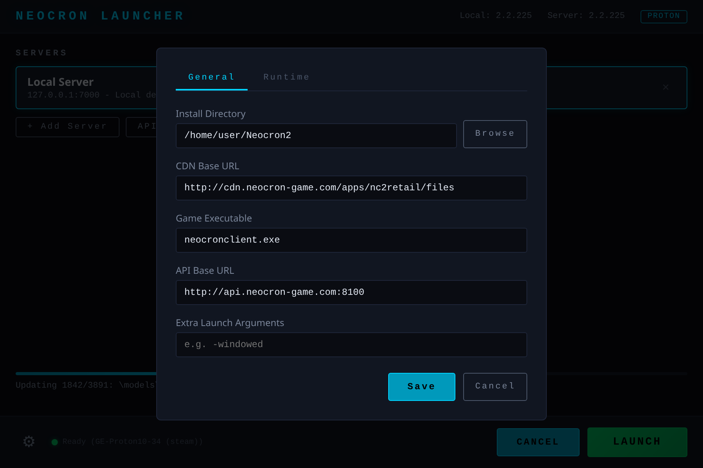
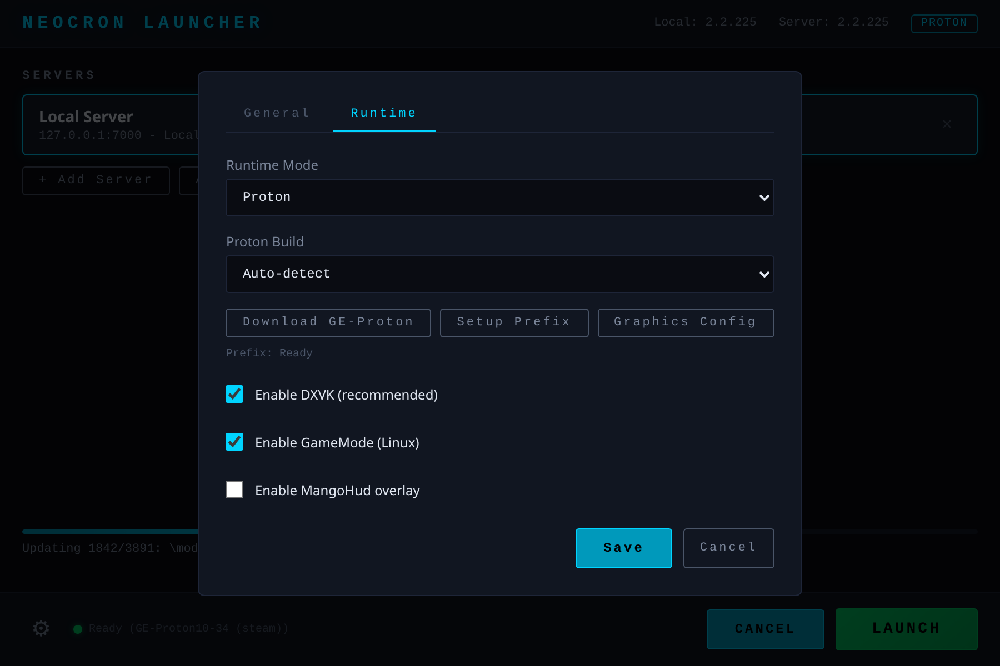

# Configuration

## Config File Location

The launcher stores its configuration at:

| OS | Path |
|----|------|
| Linux | `~/.config/neocron-launcher/config.json` |
| macOS | `~/Library/Application Support/neocron-launcher/config.json` |
| Windows | `%APPDATA%\neocron-launcher\config.json` |

## Settings

Access settings via the gear icon in the bottom-left corner.



### General Tab

| Setting | Default | Description |
|---------|---------|-------------|
| Install Directory | `~/Neocron2` | Where game files are downloaded |
| CDN Base URL | `http://cdn.neocron-game.com/apps/nc2retail/files` | CDN for game file downloads |
| Game Executable | `neocronclient.exe` | Main game binary to launch |
| API Base URL | `http://api.neocron-game.com:8100` | Neocron management API (SOAP) |
| Extra Launch Arguments | *(empty)* | Additional CLI args passed to the game |

### Runtime Tab



| Setting | Default | Description |
|---------|---------|-------------|
| Runtime Mode | `proton` (Linux/macOS), `native` (Windows) | How to run the game executable |
| Proton Build | Auto-detect | Path to Proton installation |
| Enable DXVK | `true` | Use DXVK for DirectX translation (recommended) |
| Enable GameMode | `true` (Linux only) | Use Feral GameMode for performance |
| Enable MangoHud | `false` | Show performance overlay |

### Runtime Modes

- **Proton** — Uses Valve's Proton or GE-Proton to run the game. Recommended for Linux.
- **Wine** — Uses system Wine installation. Simpler but may need manual configuration.
- **Native** — Runs the game directly. Only works on Windows.

## JSON Config Reference

```json
{
  "installDir": "/home/user/Neocron2",
  "cdnBaseUrl": "http://cdn.neocron-game.com/apps/nc2retail/files",
  "gameExe": "neocronclient.exe",
  "apiBaseUrl": "http://api.neocron-game.com:8100",
  "servers": [
    {
      "name": "Local Server",
      "description": "Local development server",
      "address": "127.0.0.1",
      "port": 7000
    }
  ],
  "activeServer": 0,
  "runtimeMode": "proton",
  "protonPath": "",
  "protonVersion": "",
  "prefixPath": "",
  "enableDxvk": true,
  "enableGameMode": true,
  "enableMangoHud": false,
  "launchArgs": ""
}
```
