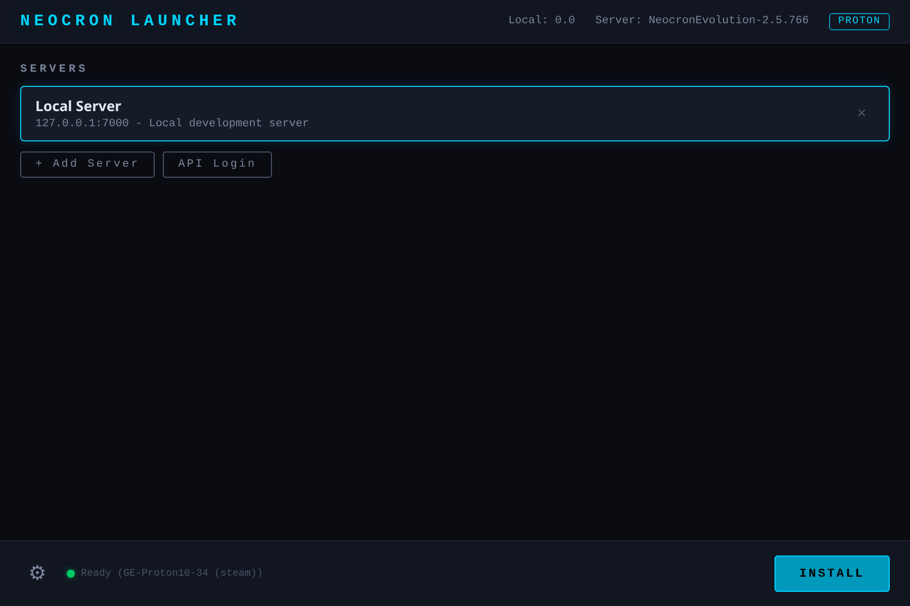

# Installation

## Download Pre-Built Binaries

Pre-built binaries are available on the [Releases](https://github.com/igwtech/Neocron-Launcher/releases) page.

| Platform | Architecture | Download |
|----------|-------------|----------|
| Linux | amd64 | `launcher-linux-amd64` |
| Linux | arm64 | `launcher-linux-arm64` |
| Windows | amd64 | `launcher-windows-amd64.exe` |
| macOS | Intel | `launcher-darwin-amd64` |
| macOS | Apple Silicon | `launcher-darwin-arm64` |

### Linux

```bash
chmod +x launcher-linux-amd64
./launcher-linux-amd64
```

### Windows

Download `launcher-windows-amd64.exe` and run it.

### macOS

```bash
chmod +x launcher-darwin-arm64
./launcher-darwin-arm64
```

> macOS may show a security warning. Right-click the binary and select "Open" to bypass Gatekeeper.

## Build from Source

### Prerequisites

- [Go](https://go.dev/) 1.23+
- [Node.js](https://nodejs.org/) 20+
- [Wails CLI](https://wails.io/) v2

### Platform Dependencies

**Linux (Arch/Manjaro):**
```bash
sudo pacman -S go gtk3 webkit2gtk
```

**Linux (Debian/Ubuntu):**
```bash
sudo apt install golang libgtk-3-dev libwebkit2gtk-4.1-dev pkg-config
```

**macOS:**
```bash
xcode-select --install
brew install go
```

### Install Wails

```bash
go install github.com/wailsapp/wails/v2/cmd/wails@latest
```

### Build

```bash
git clone https://github.com/igwtech/Neocron-Launcher.git
cd Neocron-Launcher
wails build
```

The binary is output to `build/bin/launcher`.

### Development Mode

```bash
wails dev
```

This starts a live-reloading development server at `http://localhost:34115`.

## First Run

1. Launch the application
2. The launcher detects that no game is installed and shows an **INSTALL** button
3. Click **INSTALL** to download the full game from the CDN
4. On Linux/macOS: go to Settings > Runtime to set up Proton (see [Wine Setup](wine-setup.md))


